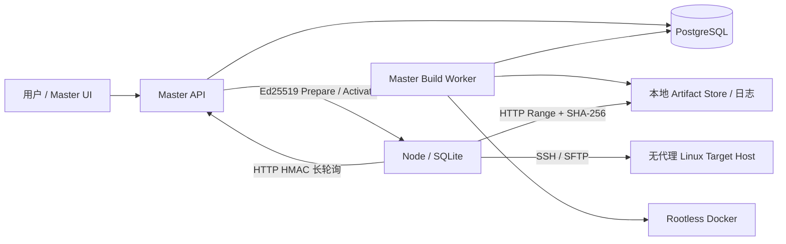

# Athena CI/CD 第二阶段设计

- 状态：已确认，待实施
- 日期：2026-08-04
- 适用范围：Athena-Master、Athena-Node、Master 管理界面、Node 只读任务界面

## 1. 目标

第二阶段把 Athena 从节点接入与资产管理系统扩展为集中式 CI/CD 平台：

1. 用户在 Master 人工选择 Git 分支、Tag 或 Commit，并发起一次构建；Master 在 Docker 隔离环境中构建一个不可变制品。
2. 用户也可以把单文件制品直接上传到 Master 制品库，跳过源码检出和构建。
3. 用户选择制品和发布配置，创建立即发布或一次性预约发布；发布须单独批准。
4. Node 主动向 Master 领取已签名任务，再通过 SSH/SFTP 将制品发布到其管理的无代理 Linux 目标主机。
5. Master 永久保存发布事实和受保留策略保护的历史制品，回滚始终从 Master 创建一条新发布。

权威领域词汇见 [CONTEXT.md](../../../CONTEXT.md)。本文中的 Build Run、Artifact、Release、Release Attempt、Release Batch、Node Task 和 Target Attempt 不得混用。

## 2. 非目标

本阶段明确不实现：

- Git push、Webhook 或其他自动构建触发；首版只有人工触发。
- 周期性发布计划；只支持创建后不可修改的一次性预约时间。
- 一个请求构建多个模块、批量构建或通用 DAG/Pipeline。
- 构建完成自动发布。
- 远程 Build Runner、注册式 Runner 池、Node 构建或目标主机构建。
- Master 多实例、高可用、对象存储或多 Master 协调。
- Windows 生产部署或 Windows 目标主机；后续版本也只支持 Linux。
- HTTPS/TLS、Athena 内置 Git 代理、动态发布路径变量、单独健康检查阶段和自动回滚。
- Kubernetes、容器镜像发布、目标主机 Athena Agent、Node 本地回滚入口。

## 3. 系统边界与主流程



完整链路为：

```text
人工发起 Build Run
→ Master 锁定完整 Commit SHA
→ Build Worker 在临时 Docker 容器构建
→ 单文件 Artifact 原子进入 Master Artifact Store
→ 用户创建并批准 Release
→ 到达一次性 scheduled_at，首批仍在 start_deadline 内
→ Master 为当前 Release Batch 创建各 Node 的 Prepare
→ Node 下载、暂存、校验并上报 ready
→ 整批 ready 后 Master 原子签发 Activate
→ Node 执行前置脚本、原子替换、后置脚本
→ Node 持久回传事件，Master 连续确认
```

Master 永远不回连 Node。心跳、任务长轮询、租约续期和事件投递是相互独立的 Node 主动请求。

## 4. 不可破坏的约束

1. **快照不可变。** Build Run 创建后绑定完整 Commit、Build Configuration Version 和实际构建环境；Release 创建后绑定 Artifact 摘要、Release Configuration Version、有序目标、脚本、路径、批大小和时间窗口。
2. **一次构建一个制品。** Artifact Glob 必须恰好匹配一个普通文件；零个或多个均失败。
3. **制品内容不可变。** Artifact Blob 由 SHA-256 内容寻址；同内容可去重，但每次构建或上传仍保留独立 Artifact 记录和审计来源。
4. **发布和批准分离。** 发起人拥有 `release.approve` 时可以批准自己的 Release，但创建与批准必须是两个显式动作和两条审计记录。
5. **预约时间是最早开始时间。** `scheduled_at` 不承诺准点；首个 Release Batch 未能在有限的 `start_deadline` 前提交 Activate 时自动过期，不补跑、不延长。首批已合法 Activate 后，后续批次不再受同一启动 deadline 限制。
6. **整批准备后才允许副作用。** Prepare 不得执行脚本、备份或正式路径替换；当前批全部 ready 后才可 Activate。
7. **副作用授权后不自动重试。** Activate 可能送达或前置脚本开始后，无法证明结果即为 Unknown Execution，必须人工裁决。
8. **目标按稳定身份寻址。** 任务使用 `(node_id, host_id)`；IP 地址只进身份快照和审计，不作为执行身份。
9. **目标主机全局串行。** 同一 Target Host 跨项目最多执行一个 Target Attempt；不同主机可以并发。
10. **回滚是一条新发布。** 不改写旧记录，不从 Node 历史目录直接执行，也不自动触发。

## 5. 部署架构

### 5.1 单 Master

Athena 永久采用单 Master。生产 Compose 包含：

- `master-api`：管理端和 Node HTTP API；不挂 Docker Socket。
- `master-worker`：Build Worker、Release scheduler 与维护任务；唯一可以访问 Rootless Docker Socket、构建工作区和受管缓存目录的进程。
- `postgres`：Master 唯一生产数据库。
- `master-ui`：静态 UI 与 HTTP Nginx 入口。

Artifact Blob、构建/发布日志、构建工作区和缓存使用独立持久卷。API 与 Worker 通过 PostgreSQL 状态交接，不共享进程内队列或锁。

Windows 启动入口仅用于本地开发。正式 Master、Node 与 Target Host 只支持 Linux。

### 5.2 数据库

- Master 正式运行只接受 PostgreSQL；测试也以临时 PostgreSQL 为准。
- Node 保持 SQLite，用于任务、可信 Master 公钥、下载断点、执行检查点和未确认事件。
- 提供旧 Master SQLite 到 PostgreSQL 的停机、一次性、可重复校验的离线迁移工具；保留原 SQLite 文件作为回退证据。
- 不保留 Master SQLite/PostgreSQL 双运行分支。

### 5.3 本地存储

Artifact Store 当前只有 Master 本地文件系统 Adapter，不提前设计对象存储 Provider。Blob 用 SHA-256 目录布局和原子重命名；数据库只保存受根目录约束的相对路径。

日志正文写本地文件，PostgreSQL 保存索引、偏移、大小与截断状态。每个 Build Run 和 Target Attempt 具有可配置硬上限，达到后写入截断标记；敏感值只做精确值掩码，不承诺识别用户自行编码或变形后的秘密。

## 6. 项目、权限与资源授权

### 6.1 项目中心

Project 是权限和配置边界，包含：

- 一套启用的 Source Configuration；
- 多套 Build Configuration，用于同仓库不同模块；
- 每套构建配置下的多套 Release Configuration；
- 普通变量、敏感变量、成员、凭据授权和目标主机授权。

项目和配置只归档，不物理删除历史。

### 6.2 RBAC

角色只是权限集合。系统提供平台管理员、项目管理员、发布操作员、只读用户四个初始模板，但后端按细粒度权限判断。至少区分：

- 管理平台资源、凭据、项目、成员和主机授权；
- 查看、创建、取消 Build Run；
- 上传和管理 Artifact；
- 创建、批准、取消、裁决、继续、重试和回滚 Release；
- 查看日志、审计和敏感字段引用。

Project 只能使用平台已授予的 Host、Host Group、Git/Registry Credential 和 Build Cache Volume。Credential Grant 只授予“使用”，不允许查看、导出或通过 API 回显密文；每次使用进入审计。

首版冻结以下稳定权限码，角色只组合权限码，前后端不得以角色名称代替授权判断：

```text
project.create / project.archive / project.member.manage / project.grant.manage
config.source.manage / config.build.manage / config.release.manage / config.publish
build.read / build.create / build.cancel
artifact.read / artifact.upload / artifact.pin
release.read / release.create / release.approve / release.cancel
release.resolve_unknown / release.continue / release.retry / release.rollback
credential.use / credential.read_metadata / credential.manage
platform.builder_image.manage / platform.build_cache.manage
platform.limits.manage / platform.signing_key.manage
audit.read
```

`credential.read_metadata` 只允许查看名称、类型、scope 和状态；任何权限都不能通过 API
读取 Credential secret 明文。

目标 SSH 密码、私钥和 passphrase 加密保存在对应 Node，Master 只保存主机身份快照。Node 强制校验 SSH Host Key Fingerprint；账户切换和 sudo 密码不由 Athena 管理，需要目标机预先配置 sudoers。

## 7. 源码与构建

### 7.1 Source Configuration

支持：

- Git HTTPS 用户名 + PAT；
- Git SSH 用户、私钥、passphrase 和 Host Key Fingerprint；
- 手动选择分支、Tag 或 Commit；
- 可选递归 submodule 和 Git LFS，沿用同一 Git Credential；
- 默认浅检出，可显式选择完整历史。

未启用 Git LFS 时若检出结果仍包含 LFS pointer，Source Snapshot 检查明确失败，不把
pointer 当作真实源码或 Artifact 输入继续构建。

用户点击创建 Build Run 时，Master 立即解析 ref 并锁定完整 Commit SHA；不能等 Worker 开始时再解析。后续分支移动不得改变已排队运行。

Athena 不配置 Git 代理。网络、代理、依赖镜像源和基础构建工具由平台管理员在宿主环境、构建镜像或项目脚本中维护。
Athena 只检出代码，不创建 Git Commit，因此不配置或维护 `user.name`/`user.email`。

### 7.2 Build Configuration Version

Build Configuration 使用“草稿 → 预检 → 启用”的版本模型。启用版本不可编辑；修改会产生新草稿。内容至少包括：

- 源码下的模块工作目录；
- 受管 Builder Image Version，或仓库中的 Dockerfile 路径；
- `sh` 或 `bash` 和用户输入的多行构建脚本；
- 超时以及 CPU、内存、PID、临时磁盘限制；
- 获授权 Build Cache Volume 的挂载引用；
- 显式普通/敏感变量引用和 BuildKit Secret 用途；
- Artifact Glob、固定制品文件名和版本标签规则。

预检验证 Git 访问、凭据、镜像 Digest 或 Dockerfile、工作目录、缓存授权、脚本字段和 Artifact Glob 安全性，不实际执行构建。

管理员停用凭据、镜像或缓存后，相关配置变为无效：禁止新建；已排队但未开始的 Build Run 进入阻塞并要求用户重新创建；正在运行的 Build Run 可完成，除非管理员取消。

### 7.3 Docker 执行

管理员维护不可变 Digest 的 Builder Image Catalog；升级镜像必须发布新版本并由配置显式采用。私有 Registry Credential 按 registry host 管理。

选择 Dockerfile 时，Worker 先通过 BuildKit 生成临时 Builder Image，再以与受管镜像相同方式运行构建脚本。Dockerfile 只定义构建环境；最终 Artifact 仍从挂载工作区收集，不是容器镜像。

Dockerfile Builder Image 的内容键必须包含 Dockerfile bytes、适用 `.dockerignore`、显式
build arguments 和解析后的基础镜像 Digest。BuildKit layer 与临时 Builder Image 受平台
容量/年龄策略清理；运行中或被排队 Build Run 快照引用的内容不得清理。Cache Volume 的
hard quota 只能由管理员登记在支持 filesystem/project quota 的专用路径上；不支持硬
quota 的路径不能作为声称受限的可写 Cache Volume 启用。

所有 Build Run 共享 Rootless Docker daemon、镜像层和管理员登记的缓存卷，但每个 Build Run 使用独立干净工作区和短生命周期容器。允许的宿主挂载只有：

- 当前 Build Run 工作区；
- 管理员登记、限定宿主路径/容器路径/读写模式/容量/项目授权的缓存卷，例如 Maven 或 npm 缓存。

禁止任意宿主路径、`/`、用户主目录、Master 数据库/密钥、Docker Socket、privileged、DinD、host network、端口映射和自定义网络。固定使用普通 Docker bridge。容器是依赖隔离，不是恶意代码安全边界；仅允许可信内部仓库、Commit、Dockerfile 和脚本。

Dockerfile 可通过 BuildKit Secret 获取显式敏感变量。平台给出泄露警告和日志精确掩码，但不阻止作者把秘密复制到镜像层、Artifact 或编码输出。

### 7.4 Build Run 状态

```text
queued → running → succeeded
                 ↘ failed
                 ↘ cancelled
                 ↘ interrupted
queued → blocked / cancelled
```

全局并发可配置，默认 1；队列严格 FIFO，不提供优先级或插队。取消先发送优雅终止，再强制停止并删除容器；取消或失败的运行不得登记 Artifact。Worker 重启清理带 Athena 标签的遗留容器并把运行中记录标为 `interrupted`，只允许人工重试。

## 8. Artifact 与人工上传

一次成功 Build Run 生成一个 Artifact。多模块 Spring Boot 项目共用 Source Configuration，但每个模块具有独立 Build Configuration，用户分别发起 Build Run；同一 Commit 构建多个制品就是多次构建、后续多次发布申请。

人工上传必须选择一套 Build Configuration，并继承其 Project、固定制品名和版本规则；
上传时不绑定 Release Configuration。它不创建虚假的 Build Run，provenance 为 `upload`，
Commit 可空。Artifact 入库后，用户可以另行选择该 Build Configuration 下任意已启用的
Release Configuration。浏览器使用分块、连续 offset、可恢复上传；完成时 Master 计算
SHA-256 并原子入库。最大文件大小可配置。

Artifact 自动清理，但以下引用具有保护作用：

- 一次性预约、准备、运行、Unknown 或待人工处理的 Release；
- 人工 pin；
- 每套 Release Configuration 可回滚的最近 N 个成功版本；
- 维护任务正在处理的临时引用。

物理清理把无保护 Blob 的文件删除，并把 `artifact_blobs.storage_path` 置空、记录
`deleted_at`；Blob 摘要行、Artifact 元数据和审计来源永久保留。不可用 Blob 不能创建
新 Release。Master 低磁盘水位停止新 Build Run 和上传；已存在 Artifact 在只读安全
水位前仍可发布。Node 低磁盘时停止领取新任务，但必须保留并继续投递未确认结果。

Master 的最近 N 个回滚 Artifact 按逻辑 Release Configuration（跨 Version）计算，只把
最终 `succeeded` Release 的最新 N 个不同 Artifact 计入窗口。部分成功的 Artifact 不占
N，但只要它仍是任一 Target Host 的当前安装、处于 Target 本地历史范围、Unknown 或
活动 Release 引用中，就单独持有。配置归档后仍保留其 N 个回滚 Artifact；归档不释放
当前安装引用。

## 9. 发布配置

Release Configuration 归属于一套 Build Configuration，同一 Artifact 可经测试、预发、生产等多套配置分别发布。配置同样采用“草稿 → Node Preflight → 启用”版本模型。

版本快照包含：

- `file` 或 `directory` 模式；
- 有序目标 `(node_id, host_id)` 和身份快照；
- 批大小，默认 1；
- 用户填写的目标路径；
- 成功历史保留数，默认值由平台配置；
- 可选的发布前、发布后多行 `sh`/`bash` 脚本；
- 用户填写的两个脚本工作目录；
- 脚本超时和平台全局上限；
- 显式普通/敏感项目变量引用。

Athena 不注入 `ATHENA_RELEASE_DIR` 等动态路径变量；目标路径、工作目录和命令全部由用户填写。项目变量仍可按配置显式注入。

### 9.1 目标展开与路径所有权

只支持管理员维护的静态 Host Group。Release Configuration Version 保存显式 Host 和
Host Group selector；启用时对当时成员执行 Preflight 并取得路径所有权，但创建 Release
时重新展开为不可变有序目标清单。组成员变化后，新成员必须先重新运行该配置 Version
的 Preflight 并在 PostgreSQL 中取得路径所有权，才允许创建 Release；已创建 Release
绝不随组变化。项目只能选择已授权目标。

文件模式的所有权键为 `(node, host, 最终文件路径)`；用户填写父目录，最终路径为“父目录 + Build Configuration 固定制品名”。目录模式拥有整个最终目录子树；用户填写被 Athena 整体管理和替换的目录。启用中的配置发生路径重叠时拒绝。

同一 Release Configuration 发布新 Version 时，可在一个启用事务中把路径 claim 从旧
Version 原子转移给新 Version；其他配置仍被拒绝。归档配置停止创建新 Release，但继续
保留当前安装和回滚引用；只有明确解除管理且目标已迁移后才释放 claim。POSIX 路径规范
化拒绝 `/`、NUL 和 `..`，折叠重复 `/` 与 `.`，保持大小写。

首次启用或预检发现正式文件已存在、目录非空且没有 Athena 安装记录时，平台不自动接管、不备份，停止并提示用户自行迁移、清理或更换路径。

目标身份的 address、port、username 或 Host Key Fingerprint 在预约后变化会阻塞执行；
只轮换密码或私钥允许继续。身份变化不能通过重新批准修补不可变快照，用户只能取消并
使用最新身份创建、重新批准一个新 Release。

### 9.2 Node Preflight

Node Preflight 是无副作用检查，不是 Release 的 Node Task。配置阶段只验证：

- SSH 连接和 Host Key Fingerprint；
- 父目录写权限、同文件系统的 staging/history 目录能力；
- `sha256sum`、shell 和解压工具；
- 首次接管状态、当前内容摘要和基础磁盘余量。

路径所有权冲突由 Master PostgreSQL 判定，不由 Node 猜测。探测最多创建并删除一个临时
文件，不执行用户脚本、不替换路径。Release Prepare 再按实际 Artifact bytes、归档安全
扫描后的展开大小、历史备份和安全余量精确检查磁盘与漂移。只有当前展开目标均有匹配
身份的有效 Preflight 和路径 claim 时，配置才能启用或创建 Release。

## 10. Release 生命周期

### 10.1 创建、批准与预约

成功 Artifact 入库后，用户单独创建 Release。创建操作绑定：Artifact ID/SHA-256/大小/固定名、Commit（如有）、Release Configuration Version、完整有序目标和身份、脚本与工作目录、批大小、变量版本、`scheduled_at`、`start_deadline`。任一变化都要求取消后新建。

所有时间在数据库和 API 使用 UTC RFC 3339；所有页面输入和显示固定为 `Asia/Shanghai`（UTC+8），不使用浏览器时区。

批准请求必须提交当前 `snapshot_sha256`，防止批准者查看后快照变化。预约发布在批准前不会执行：

- `scheduled_at` 前批准：到时进入就绪；
- `scheduled_at` 后、deadline 前批准：立即进入就绪；
- deadline 后批准：Release 过期，批准不能延长窗口。

“立即发布”在创建时固化 `scheduled_at=created_at`，`start_deadline` 使用用户明确选择的
值或平台配置的默认启动窗口，并受平台最小/最大窗口限制；批准时不重新计算任何时间。

一次性预约在创建后不可修改。取消、新时间或新目标都创建新 Release。

### 10.2 批次与跨 Node 门控

Release Attempt 按明确目标顺序切成 Release Batch。批内可跨多个 Node：

1. Master 等待当前批涉及的全部 Node 在线、协议兼容、容量和磁盘健康，并能取得全局 Target Host 锁。
2. 对首个 Batch，若到 `start_deadline` 仍不能整体预留、Prepare 并提交 Activate，则本次
   Release Attempt 过期且任何目标不得产生副作用。首批已 Activate 后，后续批次等待
   就绪不再受同一启动 deadline 限制。
3. Master 按 Node 创建并签名 Prepare Node Task。
4. Node 下载一次 Artifact，在本任务目标间复用，完成远端 staging、摘要、磁盘、漂移和身份检查后上报 ready。
5. 只有本批所有 Target Attempt 都 ready，Master 才在一个 PostgreSQL 事务中记录 `side_effect_authorized` 并为各 Node 签发 Activate。
6. 批内全部成功后自动打开下一批；失败或 Unknown 停止后续批次。

Node 本地并发以 Target work lane 计数，默认 4 并在心跳中上报。一个 Node Task 携带
当前 Batch 在该 Node 的全部目标，`capacity_cost=min(目标数, max_concurrency)`；Master
只有在可用 lane 足以覆盖 cost 时才预留，Node 在 Prepare 和 Activate 阶段都最多同时
占用该数量的 lane，目标更多时在同一 Task 内排队。`batch_size` 是 Batch 的 Target
Attempt 数上限，不是同时运行保证。不同目标可并发，同一 Target Host 全局串行。

### 10.3 Lease、fencing 与取消

Node Task 具有 `lease_id` 和单调递增 `lease_epoch`。Activate 前租约丢失可 fencing 旧 epoch、清理安全 staging 并重新分配；Activate 已签发后不得提升 epoch 或自动产生新的执行授权。

系统区分三个事实：Master 提交 `side_effect_authorized`；Node 幂等持久化
`activation_consumed`；Node 紧邻第一次外部修改前持久化 `side_effect_started`。第一次
修改是发布前脚本、历史备份或正式路径替换三者中最早发生者。每个 Target Attempt 都有
独立 activation ID 和检查点；任一持久化失败都不得跨越对应边界。Master 一旦提交授权，
即使 Node 尚未证明开始，也不得自动提升 epoch。

- pending、scheduled、queued 可以保证取消；
- Prepare 中取消会停止并清理本租约 staging；
- 已运行脚本不强制即时杀死，仍受超时控制并终止进程组；取消只阻止后续步骤和批次；
- Master 或 Node 无法证明激活后的结果时进入 Unknown Execution。

### 10.4 失败、Unknown、重试与回滚

安全下载、Range 或 staging 可在同一有效 lease 内自动续传；用户脚本、替换和后置脚本不自动重试。

当前批任一失败或 Unknown 时，尚未开始的后续批次停止；已经 Activate 的目标执行到可
证明的安全终点。`RetryFailed` 只对明确失败的目标创建新的 Release Attempt，继承原
Release 的批准快照，成功目标不重复；该动作本身要求 `release.retry` 权限、独立确认和
审计，并使用创建时固化的新立即启动窗口。整批或全部重发属于新的普通 Release，必须
重新批准。

Unknown Execution 由具备权限的用户选择“确认成功”或“确认失败”，必须填写说明并保留晚到证据。确认成功后，继续后续批次仍是独立显式动作；确认失败后可创建失败目标重试或 Rollback Release。

Rollback Release 以某次历史成功 Release 为来源，默认复制它的 Artifact、Release
Configuration 快照、脚本、路径、目标顺序和批大小，只允许重新选择一次性时间窗口；
继续走创建、批准、批次和审计流程。若用户改用当前配置或改变目标/脚本，则它是普通
Release，不是 Rollback Release。目标机本地历史只用于替换过程的保留和诊断，Node UI
不提供回滚按钮。

## 11. Target Host 执行语义

### 11.1 通用顺序

Node 对每个 Target Attempt 执行：

```text
验证 Prepare、目标身份与 lease
→ 从 Master Range 下载并校验 Artifact
→ SFTP 续传到确定性 sibling staging
→ 远端 SHA-256、磁盘、漂移、权限检查
→ 上报 ready 并等待 Activate
→ 按目标幂等持久化 activation_consumed
→ 在首次外部修改前持久化 side_effect_started
→ 可选发布前脚本
→ 备份上一条 Athena 管理的成功版本
→ 同文件系统原子替换
→ 可选发布后脚本（可包含启动和健康检查）
→ 记录安装摘要、清理超限历史、上报结果
```

脚本退出码 0 为成功。平台没有独立服务启动或健康检查阶段；用户在 post script 中实现。脚本超时杀死远端进程组；SSH 在副作用后中断且无法证明退出状态时为 Unknown，而不是普通失败。

### 11.2 文件模式

每个 Target Attempt 的 staging 路径必须绑定 `target_attempt_id + lease_epoch`，例如最终
路径同级的 `.athena-staging/<target_attempt_id>/<lease_epoch>/`；新旧 epoch 永不共享
可写路径，旧 epoch 只能清理自己的目录。Node 校验并上报该 epoch 的确切 staging 摘要，
Activate 再绑定该摘要。文件模式只备份上一条由 Athena 管理的正式文件，再通过同文件
系统 rename 原子替换。文件权限由 Release Configuration 固定。平台不处理同目录其他文件。

### 11.3 目录模式（前端）

Artifact 仍是一个 `.zip`、`.tar.gz` 或 `.tgz` 文件。Node 在同样绑定
`target_attempt_id + lease_epoch` 的最终目录同级 staging 安全解压，拒绝：

- 绝对路径和 `..` 越界；
- 设备、FIFO、hardlink 和 symlink；
- 任何落到 staging 根外的成员。

归档中的 uid/gid 被忽略。Node 备份上一条 Athena 管理的完整目录，并用 sibling rename 整体替换；当前版本不采用“current”软链接方案。staging 和 history 路径由 Athena 派生，用户只填写最终目录。

Node 按每套 Release Configuration 的最近 N 个成功版本清理目标历史。Target Host 低磁盘在任何脚本前失败，不删除当前成功版本来强行腾挪。

### 11.4 漂移

Master/Node 保存上次成功安装的文件 SHA-256 或目录 manifest 摘要。Activate 前若正式内容被 Athena 外部修改，则阻止发布并提示人工处理，不能静默覆盖。

## 12. Release Orchestration Module

发布编排实现为一个深 **Module**，以两个小型写 **Interface** 方法隐藏审批、时间、批次、租约、fencing、签名、主机锁和 Unknown 处理：

```python
class ReleaseOrchestration:
    async def decide(
        self, context: CommandContext, intent: ReleaseIntent
    ) -> DecisionReceipt: ...

    async def exchange(
        self, node: AuthenticatedNode, message: NodeMessage
    ) -> NodeReply: ...
```

`ReleaseIntent` 是封闭的 tagged union，首版包含：

- `CreateRelease`
- `ApproveRelease`
- `CancelRelease`
- `ResolveUnknown`
- `ContinueAfterUnknown`
- `RetryFailed`

后台调度器以 system principal 提交内部 `ReconcileDueReleases` intent；它不对管理 HTTP
暴露，也不能绕过 `decide` 直接写状态。调度循环运行在 `master-worker`，与 Build Worker
和 maintenance loop 独立捕获故障。

HTTP router 只负责认证、授权前置数据和序列化，不直接写 Release 状态表。生产 HTTP Node Adapter 与测试 In-Memory Node Adapter 通过 `exchange` 这一真实 **Seam** 使用同一业务规则。

查询属于独立的 `ReleaseQueries` Module/Interface，直接投影显式状态表和日志索引，不放进写 Module，也不通过重放事件构建状态。Clock 是内部可替换 Seam；PostgreSQL、SQLAlchemy、Ed25519 和本地文件系统是 local-substitutable 依赖，不为每张表制造浅 Repository Interface。

Activate 签名和数据库中的 `side_effect_authorized` 必须在同一事务事实中对齐：提交前
没有授权，提交后保守认为授权可能已送达。每个 Node 得到绑定自身 Task/lease/目标子集的
独立信封，信封内每个 Target Attempt 有独立 activation ID。相同 ID、完全相同原始 bytes
和 signature 的网络重投是幂等查询，不再次执行；相同 ID、不同内容是安全冲突。网络
丢失只能导致相同信封重发或 Unknown，不能产生新 activation。

## 13. 显式数据模型

PostgreSQL 当前状态表是事实来源；`node_task_events` 与审计日志只用于幂等收件、日志和追责，不采用 Event Sourcing。

主要表组：

| 领域 | 表 |
| --- | --- |
| 项目/RBAC | `projects`、`roles`、`permissions`、`role_assignments`、`project_members`、`project_variables` |
| 授权资源 | `credentials`、`credential_grants`、`project_host_grants`、`host_groups`、`host_group_members` |
| 构建定义 | `source_configurations`、`source_snapshots`、`build_configurations`、`build_configuration_versions`、`builder_images`、`builder_image_versions`、`build_cache_volumes`、`build_cache_volume_grants`、配置 Cache/Variable 引用表 |
| 构建执行 | `build_runs`、`build_run_logs`、`build_idempotency_keys` |
| 制品 | `artifact_blobs`、`artifacts`、`artifact_upload_sessions`、`artifact_holds` |
| 发布定义 | `release_configurations`、`release_configuration_versions`、目标 selector/展开结果、`managed_target_paths`、`release_preflight_directives`、`release_preflight_results` |
| 发布执行 | `releases`、`release_approvals`、`release_attempts`、`release_batches`、`target_attempts`、`node_tasks`、`node_task_targets`、`node_task_events` |
| 一致性 | `host_execution_reservations`、`managed_target_installations`、`release_idempotency_keys` |
| 安全/运维 | `task_signing_keys`、`node_signing_key_acceptances`、Node capability/capacity、`execution_logs`、`notifications`、现有 `audit_logs` |

关键数据库约束：

- 每套配置最多一个 draft 和一个 enabled Version；Version 和快照不可修改。
- `(build_configuration_id, version_label)` 唯一；Build Run 最多一个 Artifact。
- `(node_task_id, sequence)` 唯一，重复同内容幂等、不同内容冲突。
- `(batch_id, node_id)` 最多一个 Node Task；每个 Target Attempt 只属于一个 Node Task。
- Prepare/Activate 保存 exact bytes、signature、Key ID 和摘要；含敏感变量的 exact envelope
  必须使用 Master Credential Key 加密落库，日志、审计和 read model 不得返回明文。
- 每个 Target Attempt 的 activation ID、staging digest、`activation_consumed_at` 和
  `side_effect_started_at` 独立持久化。
- 同一 `(node_id, host_id)` 只能有一个 active reservation，Unknown 期间继续占用。
- 启用 Release Configuration 的目标文件/目录所有权不得冲突。
- 所有权威状态表包含 `state`、乐观锁 `version` 和 UTC 时间列。

长轮询等待必须在 PostgreSQL 事务和连接之外；重新进入事务后再次检查可领取事实。

Node SQLite 至少持久化 `trusted_master_keys`、Node Task、Target Attempt、per-target
activation/checkpoint、连续事件 outbox、Artifact Range parts、`managed_installations` 和
本地成功历史/manifest。含环境敏感值的原始信封使用 Node Credential Key 加密落库，
只读 UI、日志和审计不回显。漂移、首次接管和重启恢复不能只依赖在线查询 Master。

## 14. v1 Master–Node 协议与安全

项目仍在开发期，直接重写 v1 任务草案，不新增 v2、不维护旧任务草案兼容。Master 与 Node 协调升级；版本不兼容或未建立签名信任的 Node 可继续显示资产，但不得领取 Node Task。

### 14.1 HTTP 信任模型

Athena UI、API、Node 和 Artifact 全部使用明文 HTTP，只支持部署在防火墙、VLAN 或 VPN 隔离的可信管理网络。页面持续显示“HTTP 明文模式”警告。

HTTP 不提供保密性；链路观察者可读到密码、Token、JWT、脚本、日志和 Artifact。在
管理员凭据、Node Token 和 Master 私钥仍保密的前提下，签名可阻止链路攻击者直接伪造
Node Task；但被观察者窃取的管理员会话可调用 Master 创建并批准一条由 Master 合法签名
的恶意 Release。因此网络隔离是强制安全控制，签名不能把不可信网络变成安全网络。

### 14.2 认证与签名

- Node → Master：延续 HMAC-SHA256、原始 body 摘要、时间戳和 nonce。
- 普通 Master → Node 响应：Ed25519 响应签名并绑定原请求 nonce、路径、状态码、时间和精确 body。
- Preflight 与可执行授权：持久化 Ed25519 `preflight`/`prepare`/`activate` 信封，绑定
  `node_id`、Task、lease、epoch、时间窗、Artifact/staging 摘要、快照、每目标 activation
  和已解析环境 bundle。敏感值随 exact payload 加密落库，但传输仍是明文 HTTP。
- Node 先验证原始 payload bytes，再按禁止未知字段的严格模型解析，并持久化 envelope/activation ID 防重放。

初次 Master 公钥通过已有 Node Token/HMAC challenge 建立信任；已有公钥时禁止静默 bootstrap。正常轮换由旧 Ed25519 Key 签新 Key，包含 `key_id`、重叠窗口和 Node ACK。旧私钥泄露时必须由 Node 管理员重置信任，再用 Node Token 重新登记。

### 14.3 任务通道

- Node 使用独立最长约 25 秒的任务长轮询；同一 Node 只允许一个领取轮询。
- Prepare、Activate、lease renew 和 Artifact 下载绑定当前
  `(node_task_id, node_id, lease_id, lease_epoch)`。Activate 后原 epoch 过期时仍可上传日志
  与最终结果作为 `late_evidence`，但不得下载、获取新授权或自动改变 Unknown/人工裁决。
- Artifact 只接受 Master 相对任务路径，不允许任务提供任意 URL；支持标准 HTTP Range、稳定 ETag 和 SHA-256 全量校验。
- Node 事件按 `(node_task_id, sequence)` 持久化并连续 ACK。Node 只在验证 Master 签名 ACK 后删除本地事件；日志可截断，但必须投递截断标记。
- Node 任务完成后，在 Master 确认最终事件前保留本地 Artifact；收到连续 ACK 后删除，不形成跨任务永久缓存。

精确信封格式、canonical bytes、测试向量、错误码和恢复规则以 [v1 Master–Node 协议](../../api/master-node-protocol.md) 为准。

## 15. 状态机与恢复

建议显式状态：

```text
Release:
awaiting_approval → approved → scheduled/ready → running
      → succeeded | partially_failed | failed | unknown | cancelled | expired

Release Attempt:
waiting → running → succeeded | partially_failed | failed | unknown | cancelled | expired

Release Batch:
waiting → reserving → preparing → ready → activated
        → succeeded | failed | unknown | cancelled | expired

Node Task:
reserved → preparing → ready → activated → executing
         → succeeded | failed | unknown | cancelled | expired

Target Attempt:
pending → preparing → ready → activated → executing
        → succeeded | failed | unknown | cancelled
```

合法转换集中在一个状态表中，所有入口复用，API 不自行拼接状态。

恢复规则：

- Master 重启丢失内存 waiter 不丢状态；Node 立即重连。
- Worker 重启把无有效 worker lease 的运行中 Build Run 标记 `interrupted`，不自动重排。
- Node 重启恢复可信公钥、原始信封、Range metadata、事件和检查点。
- 只有 Prepare 且 lease 有效：可以续传；被 fenced：清理 staging。
- Activate 已保存但未消费：仅在同一 lease/time window 仍有效时消费。
- Master 已提交 Activate 但无法取得可信 per-target checkpoint：保守恢复为 Unknown；只有
  Node 的签名 `activation_declined` 能证明对应目标未跨越副作用边界。
- `side_effect_started` 已提交但没有确定结果：恢复为 Unknown，不重新执行脚本。
- 晚到事件保存为裁决证据，不自动覆盖人工裁决。

## 16. API 与界面边界

管理端主要资源：

```text
/api/v1/projects
/api/v1/projects/{id}/source-configuration
/api/v1/projects/{id}/build-configurations
/api/v1/build-runs
/api/v1/artifacts
/api/v1/artifact-upload-sessions
/api/v1/projects/{id}/release-configurations
/api/v1/releases
/api/v1/release-attempts
/api/v1/target-attempts
/api/v1/builder-images
/api/v1/build-cache-volumes
/api/v1/credentials
/api/v1/host-groups
/api/v1/platform-limits
/api/v1/notifications
```

写操作都使用 idempotency key 或 `expected_snapshot_sha256`/乐观锁；恢复执行只提供停机 CLI，不允许在线 HTTP API 覆盖 Master 自身数据库和密钥。

Master UI 以 Project 为中心：

```text
项目详情：源码配置 / 构建配置 / 发布配置 / 变量 / 授权 / 成员
构建记录：队列 / 实时日志 / Artifact
制品库：上传 / 版本 / 引用 / 保留
发布中心：申请 / 待批准 / 预约 / 批次 / Unknown / 重试 / 回滚
平台设置：Builder Image / Credential / Cache Volume / 限制 / 签名密钥
```

Node UI 只展示 Node Task、Target Attempt、Prepare/Activate checkpoint、日志、磁盘和连接诊断；不提供创建、批准、重试、裁决或回滚动作。首版通知只做站内通知。

## 17. 清理、备份与恢复

维护 Worker 负责：过期 nonce/上传会话/临时工作区、Artifact 保留、目标/构建日志保留、站内通知和低磁盘告警。审计默认至少保留 180 天且可配置；删除策略不得破坏 Release 快照、批准证据和 Artifact 来源。

完整备份是协调的一致集合：

- PostgreSQL dump；
- Artifact Blob；
- 构建和发布日志及其索引；
- Ed25519 私钥/公钥环；
- Credential Encryption Key；
- Compose/系统配置清单；
- 全体文件 SHA-256 manifest。

备份过程中冻结会产生新引用的写操作或使用一致快照。恢复必须先验证 manifest 和版本，再作为整套恢复；禁止只恢复数据库、Blob 或密钥中的一部分。发布前至少完成一次隔离目录恢复演练。

## 18. 验收场景

实施完成至少通过以下端到端场景：

1. 一个多模块 Spring Boot 仓库在同一 Commit 上分别运行两个 Build Configuration，复用镜像层和 Maven Cache，但工作区、容器和 Artifact 独立。
2. 分支在排队后移动，Build Run 仍检出创建时锁定的 SHA。
3. 直接上传中断后按 offset 续传，相同内容去重但元数据来源独立。
4. 两个 Node、多个 Host、`batch_size > 1` 的一次性预约 Release，在中国时区展示且从不提前执行。
5. 一个 Node 未完成 Prepare 时，其他 Node 不执行任何前置脚本或正式替换。
6. Activate 响应丢失产生 Unknown，系统不自动重试；人工裁决成功后仍需显式继续下一批。
7. 当前批一个目标失败，后续批停止；失败目标新 Attempt 重试时成功目标不重复。
8. 文件和前端目录两种模式完成原子替换、漂移阻断、安全解压和历史清理。
9. Host 地址/账号/指纹变化阻塞预约 Release，只有凭据轮换不阻塞。
10. Master、Worker、Node 在不同 checkpoint 重启均不重复远程副作用。
11. 低磁盘、Artifact 保留、日志截断、事件 ACK 和全套备份/恢复均有故障测试。
12. Master API 无 Docker Socket，Node 保持 SQLite，Master 生产配置 SQLite 时拒绝启动。
13. Prepare 在旧 lease epoch 断线后重新分配时，新旧 staging 物理隔离；旧 SFTP writer
    不能污染新 epoch 摘要或最终替换。
14. 相同 Activate exact bytes 重投只返回每目标 checkpoint，不重复脚本；相同 ID 的
    不同内容被拒绝并告警。

## 19. 决策记录

- [单 Master、本地 Build Worker 与 Artifact Store](../../adr/0001-single-master-local-build-and-artifact-store.md)
- [Master PostgreSQL、Node SQLite](../../adr/0002-postgresql-master-sqlite-node.md)
- [可信网络 HTTP 上的签名拉取协议](../../adr/0003-signed-pull-protocol-over-trusted-http.md)
- [不可变 Build、Artifact 与 Release](../../adr/0004-immutable-builds-artifacts-and-releases.md)
- [Prepare 后整批 Activate](../../adr/0005-prepare-before-activate.md)
- [Release Orchestration 的命令与 Node exchange Interface](../../adr/0006-release-orchestration-interface.md)

实施顺序、具体文件和测试见 [CI/CD 第二阶段实施计划](../plans/2026-08-04-athena-cicd.md)。
